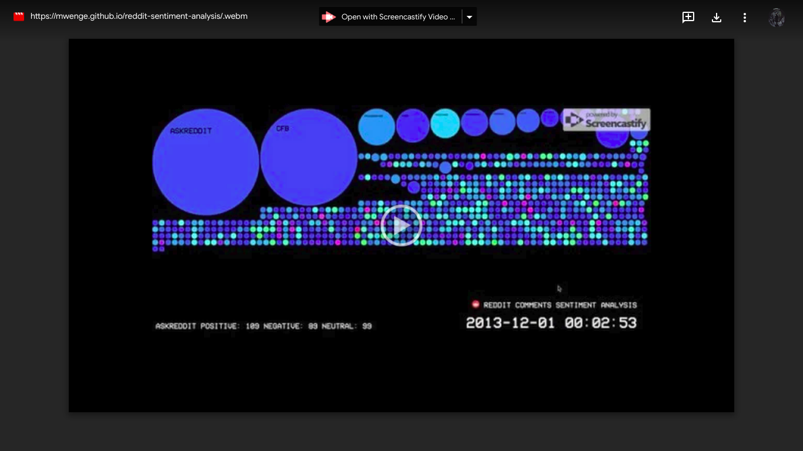
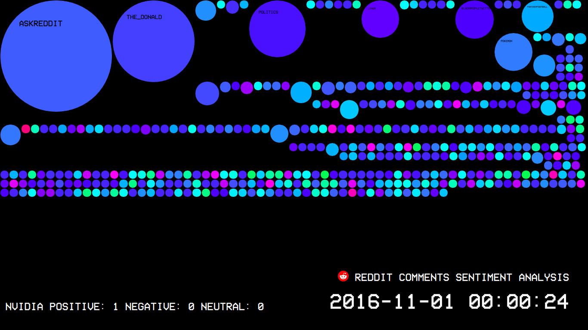
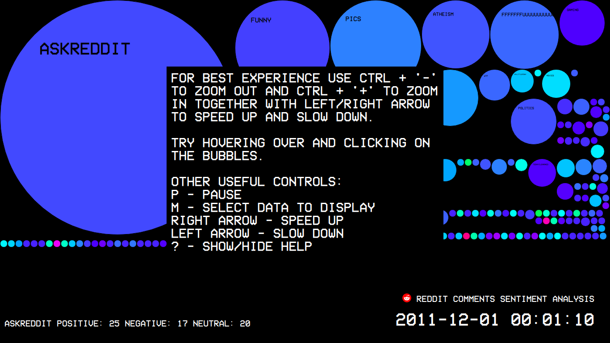
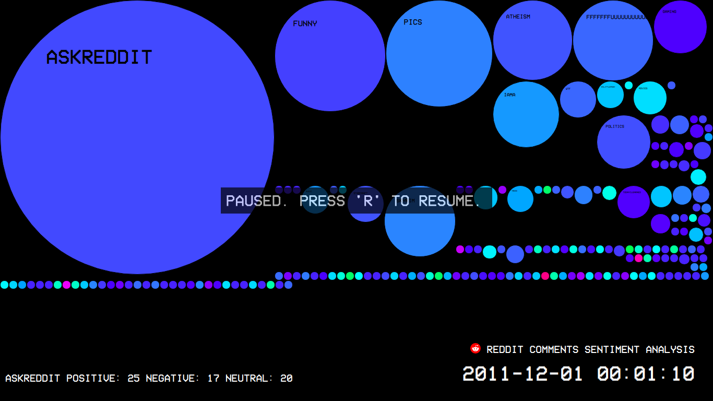
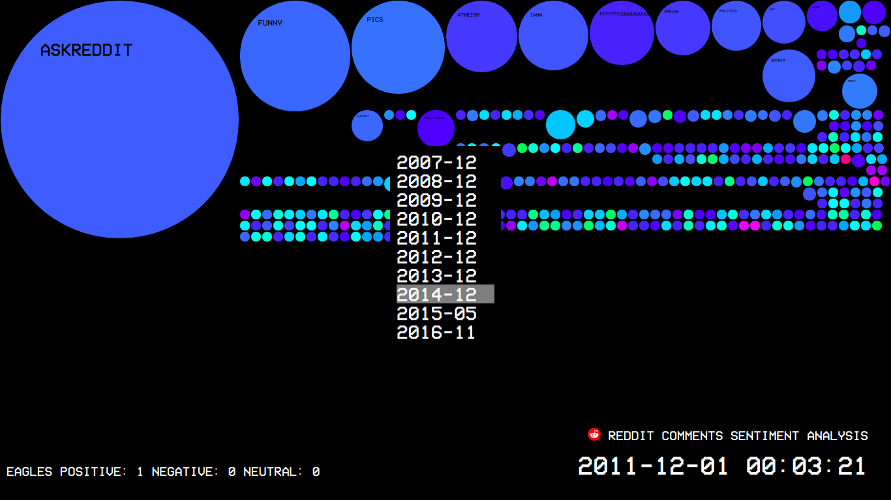
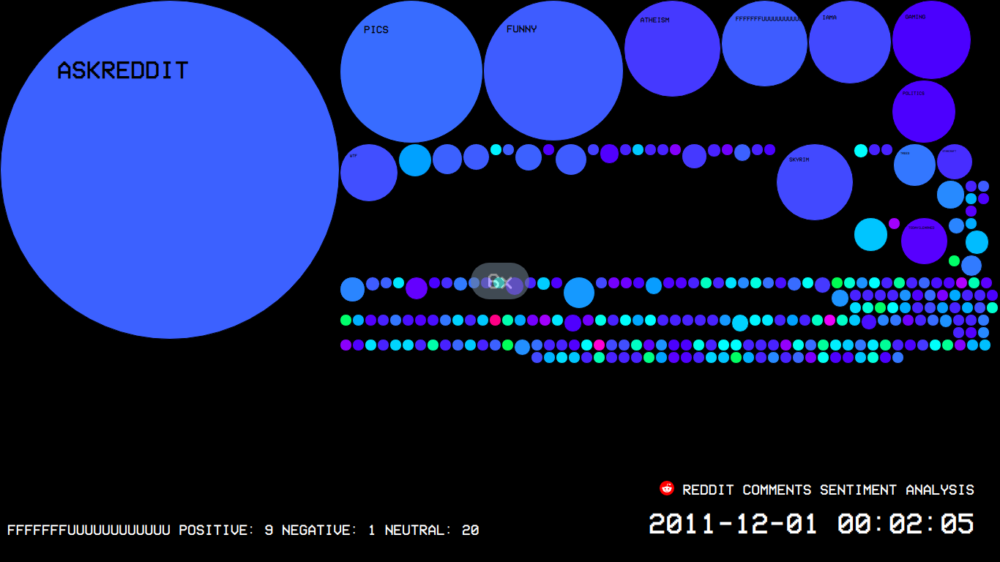
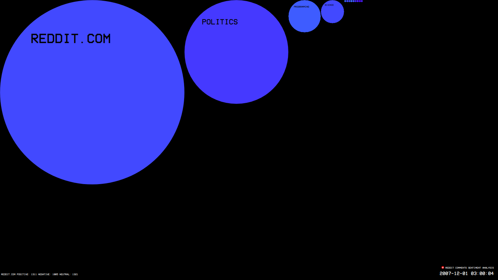
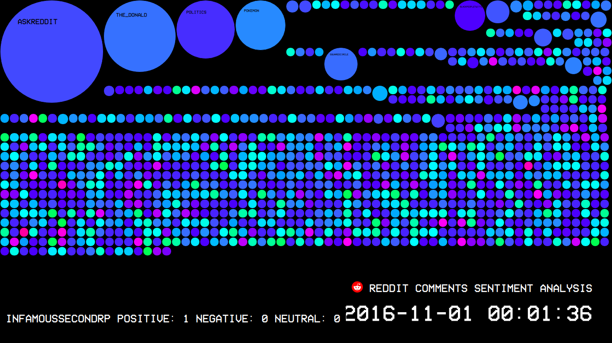
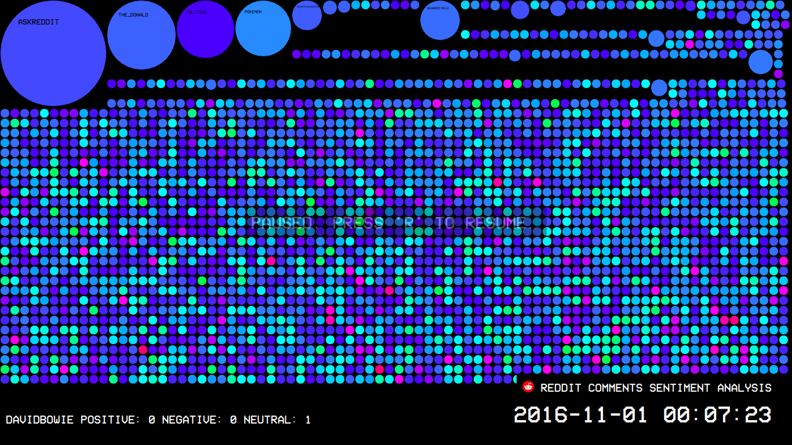

# 13091341 - B8IT107 - Data Visualization

This document is best read [on its Github page.](https://github.com/mwenge/reddit-sentiment-analysis)

[The finished visualization is available here.](https://mwenge.github.io/reddit-sentiment-analysis)

Here is an example of the visualization being used and viewed:

[](https://drive.google.com/file/d/17Hfsc0OOp4FrhTXkbDizdHIwyhnMnY9e/view)

## Overview of the Dataset Chosen for the Visualization
The dataset I chose is a nearly complete download of all comments made on the website reddit.com from 2007 through to 2017. The dataset is made available through a torrent download at https://www.reddit.com/r/datasets/comments/65o7py/updated_reddit_comment_dataset_as_torrents/. The total dataset size is huge (up to 300GB) so instead of working on the entire dataset I've chosen to pick one month from each year in the range 2007 to 2017.

When downloaded the dataset takes the form of bzipped json files. The format of each comment in the json file is:

    @JsonPropertyOrder(value = {"author", "name", "body", "author_flair_text", "gilded", "score_hidden", "score", "link_id",
            "retrieved_on", "author_flair_css_class", "subreddit", "edited", "ups", "downs", "controversiality",
            "created_utc", "parent_id", "archived", "subreddit_id", "id", "distinguished"})
        
Fortunately at https://github.com/dewarim/reddit-data-tools there is [a python script](https://github.com/dewarim/reddit-data-tools/blob/master/src/main/python/scoreCommentsJson.py) we can adapt to extract the data points we want in each comment for use in our visualization. So out first step is to make a [copy of the script](https://github.com/mwenge/reddit-sentiment-analysis/blob/master/100%20-%20scoreCommentsJson.py) and make the following adjustments:
  * Point it to a local directory 'comments' which contains the bzipped json comment files we downloaded from the reddit dataset.
  * Use ProcessPoolExecutor() to process the comments files concurrently. This will save time as there is a lot of data and we want to analyse four or five of them concurrently at any one time.
  * Update it to extract 200,000 comments for each month, that's sufficient for the purposes of our visualisation.
  * For each comment write three fields (tab-separated) to our output file: 
    * the date/time the comment was made
    * the subreddit the comment was made in
    * the sentiment score of the comment as compute by the ntlk python module. This score ranges from -1 for very negative to + 1 for very positive.

Once we've run the script we now have an [input file for each month](https://github.com/mwenge/reddit-sentiment-analysis/tree/master/comments) that we've chosen for our visualization. Here's an example of what each file looks like:
```
-0.0891	politics	2007-12-01 00:00:00
0.0	politics	2007-12-01 00:00:07
0.6604	reddit.com	2007-12-01 00:00:07
-0.1797	reddit.com	2007-12-01 00:00:08
0.1645	reddit.com	2007-12-01 00:00:24
0.0	reddit.com	2007-12-01 00:00:32
0.0386	politics	2007-12-01 00:00:35
-0.0851	gaming	2007-12-01 00:00:39
0.3591	reddit.com	2007-12-01 00:00:41
0.3548	entertainment	2007-12-01 00:00:41
```

## Objectives of the Visualisation
The objective here is to create a visualization of comments on the reddit website. The visualization will help the viewer understand the rate at which comments are made on Reddit, the sub-reddits attracting the most comments at any given time, and how negative or positive each subreddit is in terms of the comments it attracts. In addition the visualization will be interactive, allowing the user to:
 - speed up and slow down the rate at which the visualization runs
 - select data from different years for visualization
 - hover over visualized sub-reddits to learn more about the number of positive and negative comments in the subreddit
 - pause the visualization so that they can inspect the subreddits at a given point in time.

## How the Visualisation Process Works
If you haven't done so already [you can view the visualisation here.](https://mwenge.github.io/reddit-sentiment-analysis/). The visualization relies on a feature that is not enabled by default in Firefox, so you should open in Chrome. For best results, I recommend viewing in full-screen mode by pressing F11.

As you can see the visualisation is a real-time bubble visualization of comments happening on reddit. As reddits attract more comments they grow larger. The more positive their comments the brighter the bubble, the brightest being green. The more negative the comments in the reddit, the darker it gets the darkest possible color being purple.

The visualization uses HTML, CSS, and Javascript. It doesn't use any Javascript frameworks such as jquery. The code consists entirely of [index.html](https://github.com/mwenge/reddit-sentiment-analysis/blob/master/index.html) and [visualization.js](https://github.com/mwenge/reddit-sentiment-analysis/blob/master/visualization.js).

The way it works is pretty simple. When you load the page in your browser, it first reads in the comment file from 2011 that we created above and stores them in memory. It then start a timer that updates the display with the content of each comment in the dataset, one comment at a time, every 10 milliseconds. This creates the appearance of a 'real-time' view of comments happening in reddit. We use a clock, fed with the timestamps from the comments, to enhance the experience of observing a second-by-second view of comment activity on reddit.



You can press '?' at any time to see the available user commands. 



These include 'P' to pause and 'R' to resume: 



'M' to select a different year's data: 



You can use Ctrl+'+' to zoom in on the visualization, Ctrl + '-' to zoom out.
t 
Use the right-arrow to speed up, and left-arrow to slow down:



You can hover the mouse over any bubble to see how many positive/negative/neutral comments it contains. You can click on a bubble to open up that subreddit in reddit as it is today.

## What the Visualisation Tells Us
The visualisation tells us a few things, none of them very surprising!
 - Reddit grew enormously in popularity in the period 2007 to 2017. The rate at which comments are created on the site is grows noticeably each year, even when considering the narrow timeslice our visualization uses here. Compare the comments in 2007:
 
 
 With the comments in the same period in 2016:
 
 
 - The sentiment analysis on the comments, illustrated by the shade of the comment bubbles, tells us that subreddits with any kind of comment volume tend towards a balance of positive/negative comments, with positive comments slightly outweighing the negative. How boring! Subreddits ten to be most positive when there ar fewer comments. Looking at the image below from 2016 we can see that a lot of the small subreddits are bright green (indicating positive). There are only a few that are outright negative (red).  Of the subreddits attracting a lot of comments, THE_DONALD and POKEMON are notably more positive (brighter) than the rest. So the reader can draw his/her own conclusions abou the sort of people who comment on reddit!

 
 
## Conclusions
The time-series bubble technique I've chosen here isn't an overwhelming success but it does provide some insights. Allowing the user to interact with the visualisation by speeding it up, choosing years to view, and hover/click on subreddits that interest them is definitely one of the successes of this project. However we need to find other ways of presenting the comment data, maybe over a tield plain or presenting it as an interactive ribbon chart. 

One of the main challenges in building this project was choosing an exciting/interactive display mode that suits the data. I don't think I've overcome this challenge yet. On the whole though I'm happy with the framework I've created for presenting the data and will probably continue to build on it to create new options for presentation. I think it will be useful for other datasets that are time-series based and can offer the user interested in exploring trends and drilling down into details an engaging experience.


